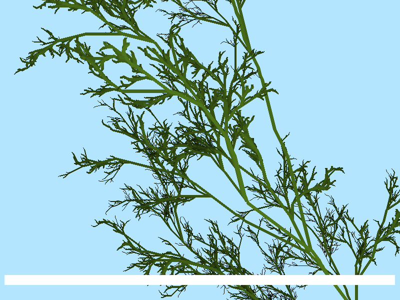

# L-System Tree Drawing
## Overview
A quick study on Lindenmayer system formal grammars, in this case used for semi-realistic tree drawing. Requires **[Pygame](https://www.pygame.org/news)**. If you are running on a slower machine, it may suffice to press `RETURN` while the tree is being drawn (skips to finished drawing), so that you don't wait a long time for it to finish rendering.

## Algorithm
The formal grammar used in this study uses the following recursive generation rules:
* **Axiom**
  * `X`
* **Rules**
  * `X -> F-[[X]+X]+F[+FX]-X`
  * `F -> FF`
  
The above rules are interpreted graphically as follows:
* `F` **Draw** a straight line (branch) along the current angle
* `{+|-}` **Rotate** current branch left/right 170 degrees
* `[` **Enter** a sub-branch
* `]` **Leave** a sub-branch

The follow image was generated using seven layers of recursion: 

## Dependencies
* **[Pygame](https://www.pygame.org/news)** 1.9.3+
* **[Python](https://www.python.org/)** 3.4+
